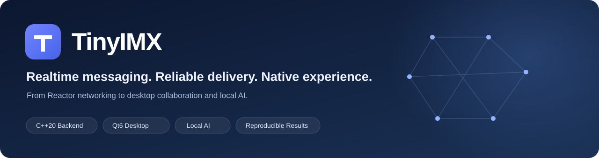
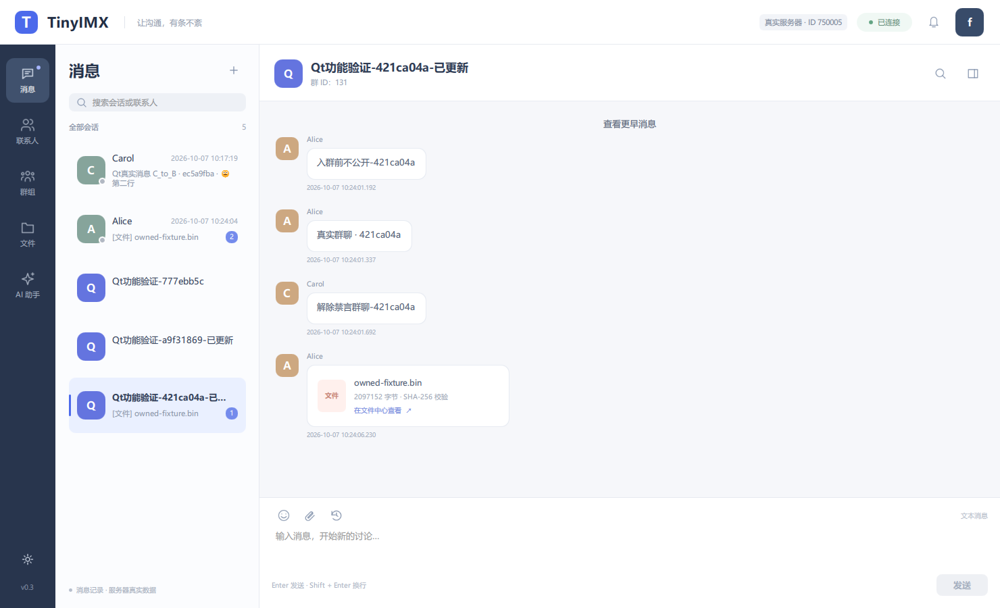
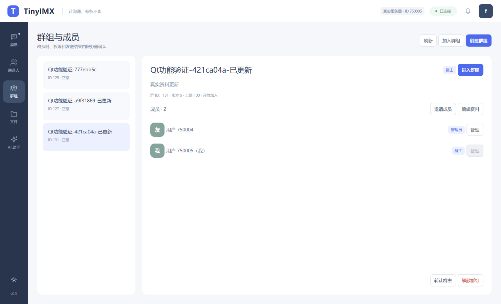
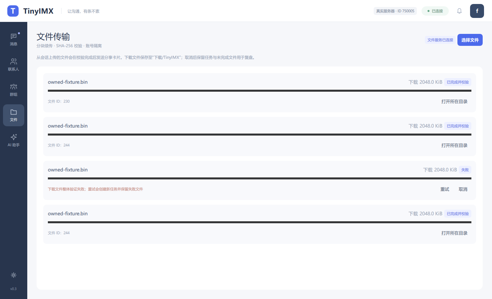
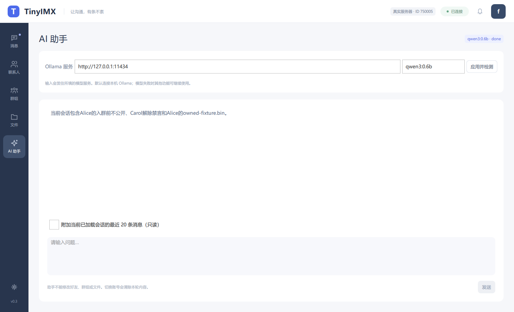
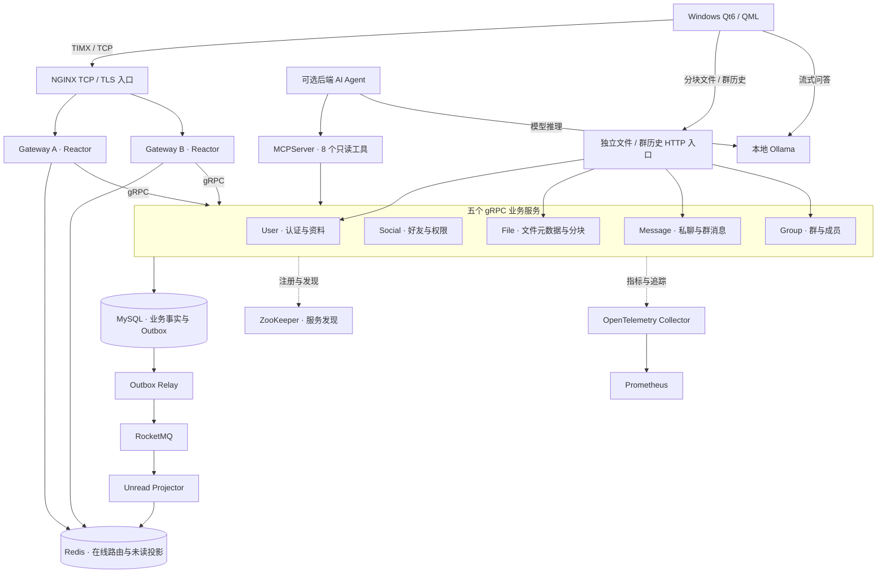
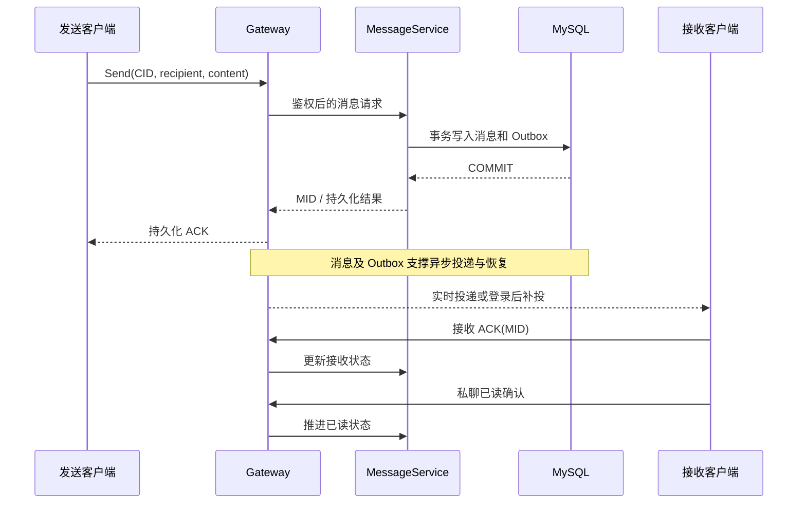

<p align="center"></p>

<h1 align="center">TinyIMX</h1>
<p align="center"><strong>高并发即时通信与智能协作系统</strong></p>
<p align="center">Linux C++ 后端 · Windows Qt6 原生客户端 · 可靠消息 · 授权文件共享 · 本地 AI</p>

<p align="center">
  
  
  
  
  
</p>

<p align="center">
  <a href="#产品体验">产品体验</a> · <a href="#功能全景">功能全景</a> · <a href="#系统架构">系统架构</a> ·
  <a href="#快速开始">快速开始</a> · <a href="#性能与验证">性能与验证</a> · <a href="#文档导航">文档导航</a>
</p>

---

## 项目介绍

**TinyIMX 把实时聊天、群协作、授权文件与本地 AI 放进同一个原生桌面工作流。** 用户可以添加好友、进行私聊和群聊、恢复离线消息、查阅历史、共享文件，再按需使用 AI 助手理解当前会话。

系统从网络层到业务服务、存储与桌面交互独立设计并落地：自研 Reactor 承载 TCP 长连接，双 Gateway 连接五个 gRPC 业务服务，MySQL / Redis / RocketMQ 串联可靠消息，Qt6/QML 提供真实客户端交互，Prometheus 与 OpenTelemetry 支持观测和问题定位。

**`main` 提供完整源码、协议、数据库结构、部署脚本、Qt6 工程、测试和性能复盘。** 克隆默认分支即可查看完整实现；本地业务数据库、私有配置、模型权重与编译产物由使用者自行创建。

| 1 万认证长连接 | ≤57.5 ms | 80.46% | 8 个 |
| :---: | :---: | :---: | :---: |
| 单机指定混合负载实测 | 私聊持久化 ACK P99 上界 | ABBA 会话页 P99 降幅 | 权限受控的只读 MCP 工具 |

> 数据对应 8 vCPU / 约 16 GiB 虚拟机、指定后端版本与 60 秒负载窗口；连接数、请求率和功能验收范围分别说明，详见[性能与验证](#性能与验证)。

## 产品体验

### 消息与协作

原生三栏工作区整合会话、私聊 / 群消息、历史与附件卡片。消息区分服务器持久化、接收确认和已读状态，支持多行文字与 Unicode。



<details>
<summary><strong>展开查看群管理、文件任务与 AI 助手</strong></summary>

### 群管理

建群、加入、邀请、成员角色、禁言、群主转让、退出和解散，通过服务端权限校验落到真实业务。



### 文件任务

独立通道支持分块、暂停 / 续传、取消 / 重试与完整性校验，完成上传后再向会话发送授权附件卡片。



### 本地 AI

Ollama 流式问答支持模型检测、停止生成，以及由用户选择是否附加当前已加载会话片段。



</details>

以上为已保存的真实服务功能联调截图，使用专用演示 / 验收账号；[设计预览](clients/qt6/preview)使用独立样例数据。截图中的群名、消息和文件为验收样例。

## 功能全景

| 模块 | 用户可以做什么 | 实现要点 |
| --- | --- | --- |
| 账号与会话 | 密码登录、心跳保活、重新登录、识别其他位置登录 | 加盐 PBKDF2-HMAC-SHA256；Redis 在线路由与 SessionEpoch；同机同账号窗口锁 |
| 好友关系 | 按用户 ID 申请、接受 / 拒绝、查看列表并发起私聊 | 私聊鉴权；好友受理事务；双向关系一致性 |
| 私聊消息 | 实时收发、多行 / Unicode、失败重试、离线补投 | TIMX 帧协议；持久化 ACK；CID 幂等与 MID 去重；接收端确认 |
| 会话与历史 | 会话列表、未读数、历史分页、私聊已读 / 未读 | MySQL 历史数据；Redis 未读投影；有界批量读取 |
| 群协作 | 建群、开放加入、邀请 / 移出、角色、禁言 / 解除、资料修改、转让 / 退群 / 解散 | 群组与成员分页；版本冲突检查；当前成员与原投递快照约束历史访问 |
| 文件共享 | 私聊 / 群聊附件、分块上传、断点续传、取消 / 重试、下载 | 256 KiB 上传块；分块 / 整文件 SHA-256；HMAC 授权；终验后分享 |
| 原生桌面 | 多账号、多窗口、会话切换、文件任务与消息交互 | Qt Quick / QML；异步 TCP / HTTP；按账号隔离传输任务；QSharedMemory |
| AI 助手 | 流式问答、模型检测、生成取消、可选会话上下文 | 当前已加载最近 20 条消息按需附加；模型失败不阻断聊天 |
| MCP 扩展 | 受控读取资料、好友、会话 / 历史、群组 / 成员、文件元数据 | 8 个只读工具；服务端派生身份；gRPC 权限校验与期限传递 |
| 运维与观测 | 健康检查、指标、链路分析、源码 / 结果复盘 | Compose；OpenTelemetry Collector；Prometheus；版本化验收记录 |

### 一条完整的使用路径

1. Alice 与 Bob 登录不同客户端，通过好友申请建立关系。
2. Alice 发送私聊；服务端先持久化，再异步投递，Bob 接收后确认。
3. Bob 离线期间，Alice 继续发送；Bob 重新登录后恢复待确认消息与历史。
4. Alice 建群并邀请 Bob / Carol，使用群角色与禁言规则协作。
5. 上传文件，完成 SHA-256 终验后分享；接收者通过授权附件卡片下载。
6. 用户按需启用本地 AI，选择是否附加当前会话片段进行问答。

## 系统架构



桌面 AI 当前直接调用 Ollama；后端 Agent / MCP 是独立扩展链路。文件字节不进入聊天 Gateway 的消息执行队列，独立入口负责派生登录身份并调用对应服务。

### 核心技术栈

| 层次 | 技术与职责 |
| --- | --- |
| 后端构建 | **C++20**、Linux、CMake、vcpkg；以根目录构建配置为准 |
| 网络与并发 | epoll、EventLoop、Reactor、TCP、TIMX、有界执行器、同键 FIFO |
| 服务协作 | gRPC / Protobuf、ZooKeeper 动态发现、双 Gateway 路由 |
| 数据与事件 | MySQL、Redis、事务 Outbox、RocketMQ |
| 桌面客户端 | **C++17 / Qt6 / QML**；Qt 6.8+，已有验证环境为 Qt 6.10.2 MinGW 64-bit |
| 文件与身份 | SHA-256、HMAC、PBKDF2-HMAC-SHA256、服务端身份派生 |
| AI 扩展 | Ollama、流式响应、MCP、OpenAI-compatible 后端 Provider |
| 部署与观测 | Docker Compose、NGINX、OpenTelemetry、Prometheus |

## 快速开始

```bash
git clone https://github.com/Aoxiangda/TinyIMX.git
cd TinyIMX
```

| 目标 | 操作入口 |
| --- | --- |
| 先看客户端界面 | Qt Creator 打开 `clients/qt6/CMakeLists.txt`，构建后以 `--demo` 启动 |
| 构建 Linux 后端 | 配置 vcpkg，使用 `cmake --preset linux-release` |
| 联调真实多客户端 | 部署后端、启用桌面文件入口、创建自有演示账号，再连接服务器 |
| 查看性能与工程细节 | 阅读性能证据、模块源码与复盘文档 |

完整步骤见 **[公开源码构建与联调指南](docs/getting-started/QUICKSTART.md)**，包含依赖、首次部署、账号创建、Qt 打包、模型配置与排错。

### Linux 后端

准备支持 C++20 的工具链、CMake 3.24+ 与 vcpkg，将 `VCPKG_ROOT` 指向已引导的 vcpkg 目录：

```bash
cmake --preset linux-release
cmake --build --preset build-release --parallel 2
ctest --test-dir build/linux-release --output-on-failure
```

这是基础构建；带 RocketMQ 的完整运行镜像由 `scripts/m21_build_runtime_image.sh` 构建，SDK 和共享库闭包单独处理。部分集成测试需要外部服务，按模块准备环境后执行。

### Windows Qt6

推荐使用 Qt Creator：打开 `clients/qt6/CMakeLists.txt`，选择含 Quick、QuickControls2、Svg、Network 的 Qt6 Kit，构建 Release。

```powershell
# 在客户端构建输出目录中执行。
.\tinyimx_desktop.exe --demo

# 改为自己的 Linux 服务器私网地址和新建账号。
.\tinyimx_desktop.exe --endpoint "192.168.1.10:9000" --username "demo_alice"
```

不同账号可各开一个窗口；同一入口、同一用户名限制重复窗口。分发时使用 `windeployqt` 收集 DLL、QML 和平台插件，保留完整部署目录。

### 部署与账号

从 [`.env.example`](deploy/production/.env.example) 创建 `.env`，设置自己的数据库、Redis 与 MCP 凭据；运行状态使用独立目录，凭据不进入 Git。

```bash
# 在新的独立部署中执行，先完成 QUICKSTART 的依赖与环境配置。
bash scripts/run_m21_production_contract_gate.sh
bash scripts/m21_build_runtime_image.sh
bash scripts/run_m21_production_runtime_gate.sh
```

文件 / 群历史入口通过 [桌面 Compose overlay](deploy/production/docker-compose.desktop.yml)启用，默认绑定 `127.0.0.1:18082`，跨机器连接时显式配置可信私网接口。

客户端不提供自助注册。[演示账号助手](clients/qt6/server/create_demo_accounts.py)支持先只读预检，再显式 `--apply` 并交互输入密码创建三个新账号；不修改已有账号、不重置密码、不直接插入好友关系。

## 可靠性与权限设计

### 从保存到已读



- **确认边界：** 服务器入库 ACK、接收端 ACK、已读是不同阶段。
- **重试身份：** 发送方与 CID 唯一约束避免重复建消息，客户端按 MID 去重。
- **事务与事件：** 消息与 Outbox 同事务写入，RocketMQ 驱动事件处理，Redis 承担可重建的未读投影。
- **异常恢复：** 未确认消息可补投，ACK 丢失允许重试，重复投递按幂等规则处理。

### 会话、群与文件

- **会话治理：** 心跳、Redis 在线路由与本地 SessionEpoch 配合，确认登录替换后精确失效旧连接；Redis 故障不直接视为登录替换。
- **并发边界：** 有界执行器限制积压，同键 FIFO 约束本执行器内同键任务顺序，支持过载拒绝、取消与优雅停机。
- **群历史 ACL：** 校验当前成员身份，并结合发送者 / 原投递快照约束可读记录，后入群不自动获得全部旧消息。
- **文件授权：** 分块 / 整文件双层校验；HMAC 凭证绑定接收者或群组，下载时再次核验身份 / 成员关系。
- **客户端恢复：** 上传 ID 迟到时补偿取消；损坏下载可创建新任务重下；传输日志按账号和入口隔离。

## 性能与验证

### 万人连接指定混合负载

测试环境为 **8 vCPU / 约 16 GiB Ubuntu 虚拟机**。接受轮与 ABBA 是分别保存的实验，不能拼成一次测试。

| 条件 / 指标 | 实测范围 |
| --- | --- |
| 长连接 | 10,000 条已认证 TCP 连接 |
| 私聊 | 100 条/s，持续 60 秒 |
| 会话页 | 每页完整 50 项，20 次/s，持续 60 秒 |
| 交互 | 跨 Gateway 投递与低频业务操作链 |
| 接受轮持久化 ACK | **P99 上界 ≤57.5 ms** |
| 接受轮会话页 | **P99 ≤38.3 ms** |

**1 万连接不等于 1 万请求/s**；上述结果对应指定连接数、请求组合与版本，不替代所有功能分别进行容量验收。

### Redis N+1 可复现优化

50 项会话原先逐项租借健康连接并 GET，产生 50 次租借、50 次 PING 与 50 次读取。新路径复用一次健康连接租借，以一次有界 Lua 批量返回原始值。

| 指标 | 优化前 | 优化后 |
| --- | ---: | ---: |
| 单页连接租借 | 50 | **1** |
| 单页网络命令 | 100 | **2，减少 98%** |
| 10k ABBA 会话页 P99 | 原始 OFF / ON 对照 | **至少降低 80.46%** |
| 10k ABBA 私聊 ACK P99 | 同上 | **至少降低 18.12%** |

Lua 内部仍读取 50 个键，收益来自减少网络往返和连接租借。保留返回顺序、原始整数精度、missing / wrongtype 等语义，真实 Redis 一致性检查 **248 项通过**。

证据：[未读批量优化与 ABBA](docs/performance/CONVERSATION_UNREAD_BATCH_RESULT_20261006.md)、[性能评估](docs/performance/CURRENT_PERFORMANCE_ASSESSMENT_20261006.md)、[容量验收边界](docs/performance/CAPACITY_OPTIMIZATION_AND_ACCEPTANCE_20261007.md)。优化保留独立开关，基础部署不自动等于历史压测配置。

### 验证覆盖与当前状态

| 验证类型 | 保存内容 |
| --- | --- |
| Qt 状态 / 协议 | CTest 状态契约与 TIMX 协议检查 |
| 正常功能联调 | 好友、私聊 / 群聊、权限、历史、文件字节与模型生成 |
| 异常与交叉链路 | 登录替换、重复请求、取消竞态、跨账号授权、下载校验恢复 |
| 性能实验 | 负载合同、成功 / 失败、版本、分段诊断与恢复记录 |

已保存的 20k baseline 在 135 私聊/s + 20 会话页/s 下，私聊 ACK P99 上界 **132.9 ms**、会话页 P99 **90.746805 ms**，私聊未通过原 100 ms 门槛。50k 全功能容量尚未验收；Qt6 联调后未重新运行全套容量压测。[暂停前最新状态](docs/performance/PRESSURE_PAUSED_FOR_QT6_20261007.md)保留完整结论。

## AI 与 MCP 工具

**桌面侧：** Ollama 流式问答、模型检测、停止生成、可选当前会话上下文；只包含当前已加载的最近消息，勾选后才发送给配置的模型服务。

**后端侧：** MCPServer 暴露以下只读能力，供独立 Agent 调用。身份从服务端认证上下文派生，参数不能任意指定 actor。

| 工具 | 能力 |
| --- | --- |
| `tinyimx.user.get_self_profile` | 当前用户资料 |
| `tinyimx.social.list_friends` | 好友列表 |
| `tinyimx.message.list_conversations` | 会话列表 |
| `tinyimx.message.list_history` | 可访问的消息历史 |
| `tinyimx.group.get` | 群信息 |
| `tinyimx.group.list_my_groups` | 当前用户群组 |
| `tinyimx.group.list_members` | 授权群成员 |
| `tinyimx.file.get_metadata` | 授权文件元数据 |

桌面 AI 当前不自动执行这些 MCP 工具，也不会自动修改业务数据。后端 Agent 的模型端点与模型名需独立配置；推理性能按机器和模型分别评估。

## 项目结构

```text
TinyIMX/
├── common/                 # 配置、日志、网络、并发、数据库、缓存与观测
├── gateway/                # 连接、TIMX 路由、会话与业务接入
├── services/               # 五个业务服务、RPC 与 AI/MCP
├── proto/                  # Protobuf / gRPC 契约
├── clients/qt6/            # Qt6/QML 桌面、协议、自检与截图
├── deploy/production/      # Compose、模板、NGINX、观测与桌面 overlay
├── db/migrations/          # 数据库迁移
├── scripts/                # 构建、部署、校验、诊断与历史验收
├── tests/                  # 单元、契约与模块验证
├── benchmark/              # 负载与证据工具
├── docs/                   # 快速开始、功能、性能与复盘
├── examples/               # 服务可执行入口与示例
└── CMakeLists.txt          # Linux 后端构建入口
```

## 文档导航

| 想了解什么 | 文档 |
| --- | --- |
| 新机器获取、构建、部署与联调 | [公开源码快速开始](docs/getting-started/QUICKSTART.md) |
| Qt6 功能、构建和打包 | [客户端说明](clients/qt6/README.md) |
| 后端 Compose、端口与数据目录 | [部署说明](deploy/production/README.md) |
| 正常业务功能与已知问题 | [功能完善记录](docs/client/FEATURE_COMPLETION_20261007.md) |
| 客户端验证结果 | [功能验收](clients/qt6/validation/FEATURES_20261007.json)、[迭代记录](clients/qt6/validation/ITERATIONS_20261007.json) |
| 性能优化、合同与失败 | [容量状态](docs/performance/CAPACITY_OPTIMIZATION_AND_ACCEPTANCE_20261007.md)、[问题台账](docs/performance/ISSUES.md) |
| 全项目复盘 | [项目复盘](docs/retrospective/PROJECT_REVIEW_20261008.txt) |
| 原开发环境账号与数据 | [历史交接手册](docs/client/PROJECT_HANDOVER_20261007.txt)、[原环境启动](docs/client/NORMAL_SERVER_WINDOWS_CLIENT_20261007.md) |
| 本次 main 发布与入口修正 | [发布记录](docs/retrospective/PUBLICATION_20261009.md) |

历史文档中的 VM IP、本机路径、演示账号和容器身份属于原开发环境，新部署以快速开始中的自有配置为准。

## 当前范围与后续计划

- [x] 私聊 / 群聊、好友受理、离线与历史、私聊已读 / 未读。
- [x] 群成员与角色治理、群历史 ACL、授权文件及续传。
- [x] 多账号 Qt6 客户端、Ollama 流式问答、后端只读 MCP。
- [x] 双 Gateway、gRPC 微服务、Compose 与可观测性。
- [ ] 自助注册 / 改密 / 资料编辑、删除好友。
- [ ] 持久化群已读、全量联系人 / 会话分页、在线状态订阅。
- [ ] 持久化草稿 / AI 历史、跨设备任务同步。
- [ ] Qt 客户端 TLS 与公网入口加固。
- [ ] 20k-50k 全功能容量、热点群、故障恢复与长期稳态验收。

当前单文件上限 **64 MiB**、每账号本地最多 **100 个文件任务**、新群默认成员上限 **100**。当前客户端明文入口用于可信私网联调；NGINX TLS 入口不代表 Qt 客户端已经启用 TLS。

## 参与与交流

欢迎通过 [Issues](https://github.com/Aoxiangda/TinyIMX/issues)反馈问题，或通过 [Pull Requests](https://github.com/Aoxiangda/TinyIMX/pulls)提交改进。建议附带提交版本、复现步骤、部署方式、脱敏日志和指标对应负载。

源码与文档公开，方便学习、复现和评审；仓库目前未声明独立开源许可证，使用与再分发授权可通过仓库 Issues 联系作者。

<p align="center"><strong>TinyIMX · 让沟通，有条不紊。</strong></p>
