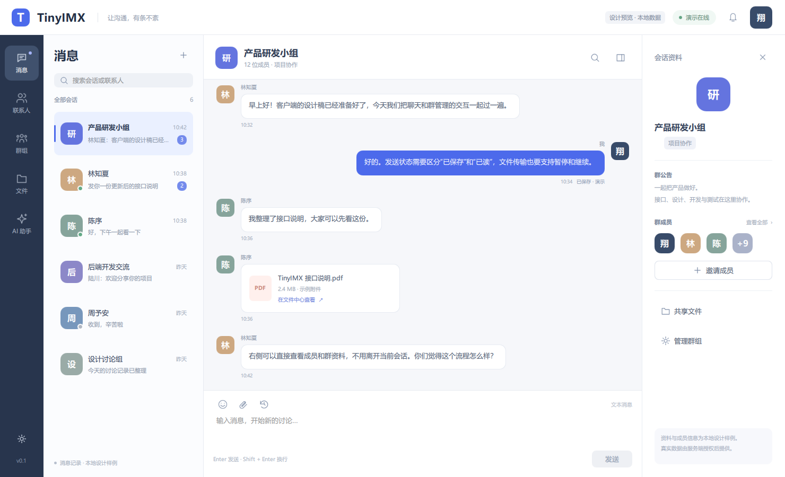
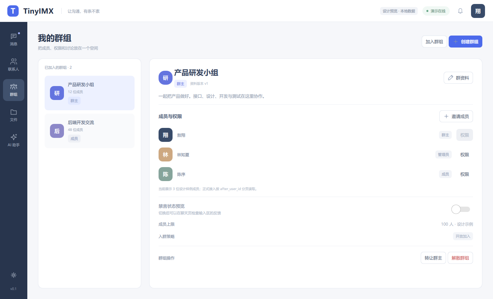
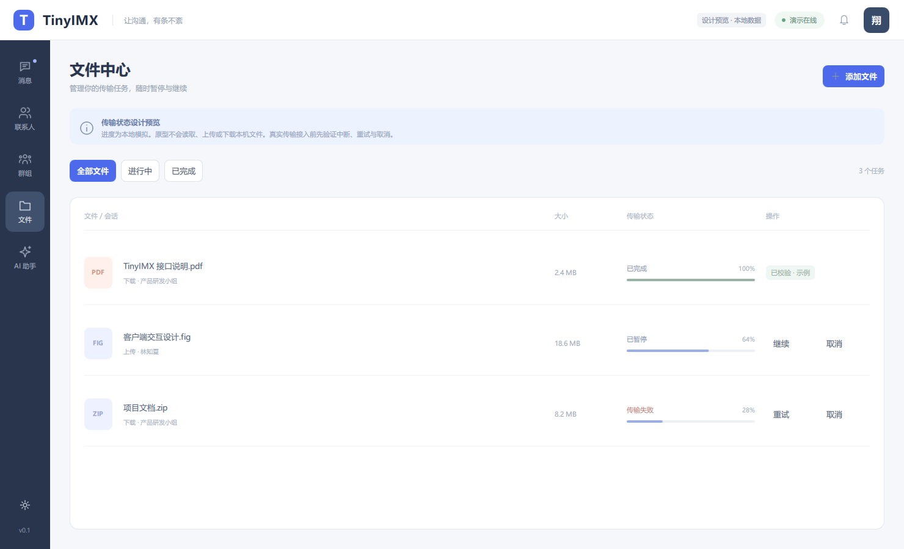

# TinyIMX Qt6 客户端设计规范

日期：2026-10-07。设计依据：当前 `common/protocol/Packet.h`、私聊/群投递协议、Gateway 处理入口、真实全功能操作链、文件 gRPC 示例及 Agent/MCP 实现。

## 本次交付边界

交付本机 Qt 6.10.2 + C++ / Qt Quick 可运行的 UI 原型，覆盖主要页面、导航、表单、确认与异常状态。合成数据只保存在进程内存中。
本版没有服务端网络连接，不发送账号密码，不读取或传输本机文件，不调用 Ollama。登录、真实传输与上下文授权接入明确标为待接入。
加入群、邀请成员、资料编辑和细粒度成员权限属于交互入口预览；现版不伪造服务端成功结果。创建群、申请处理、消息和传输状态由本地模型演示。

用户已要求暂停压测。本次客户端工作不启动容量工作进程、不改变容器、配置、持久化、VMware 或其他应用。

## 信息架构与视觉系统

桌面窗口默认 1480×900，最小 1080×720；使用系统标题栏，保留原生拖动、缩放和关闭行为。
顶部为品牌、模式标识、状态切换和当前用户；左侧固定 82 px 功能导航。消息页使用约 276–302 px 会话栏、可伸缩聊天区域、270 px 资料栏。
可用内容宽度小于 1200 px 时隐藏资料栏，保证消息与输入可见。资料展开按钮的窄屏抽屉仍是后续增强，不能将隐藏栏称为已实现抽屉。

背景 `#f6f7fa`，内容白色，导航 `#28354d`，强调色 `#4c6aeb`；会话选中为浅蓝，错误采用文字+暖红色，离线/禁言采用文字+提示条。
普通内容使用 13–14 px，页面标题 23–25 px，主按钮高度 36 px，圆角 8–14 px。头像为本地字头像，图标为本任务的 SVG 矢量图，不依赖外部图片服务。
本版实现浅色主题；深色主题属于后续扩展。需在正式产品阶段完成全部文本对比度、焦点顺序、高对比度和屏幕阅读器验收。

## 页面设计

### 登录与账号

用户名、密码遮罩、网关地址、登录状态和进入设计预览分开。正式接入状态应为：未连接 → 连接中 → 认证中 → 同步资料 → 就绪。
认证失败保留用户名并聚焦密码；连接失败保留地址并提示重试；重复登录踢出时保留草稿，关闭网络会话后返回登录。
不将重连误当认证成功，不静默使用已失效身份。密码不写入日志、普通配置或 Git；未来令牌存储使用操作系统凭据设施。
当前服务端没有在 Packet 枚举中提供注册和资料修改接口，因此本版不展示可提交的注册或资料编辑成功流程。

### 消息与会话

会话条目呈现字头像、名称、最新摘要、时间、未读与群/私聊类型；搜索当前已加载的会话和消息，不能称为服务端全文检索。
历史按消息游标加载，初始页建议最多 50 条；查看较早内容时，新消息到达只提示，不强制跳到底部。
发送状态应至少区分草稿、等待提交、请求中、服务端持久化、收件确认、已读、失败、结果不确定。
`stored_persistent=true` 可表示服务端保存；`delivered=true` 的具体含义按服务端契约展示；不能把服务端 ACK 或收件端协议 ACK 当作用户已读。
本地原型只显示“已保存 · 演示”和失败，不声称真实持久化或已读。
业务 `client_message_id` 在重试中保持不变；网络 `Packet.seq` 可更换。超时属于结果不确定，不能直接追加第二条业务消息。
收到重复投递后，按稳定 `message_id` 去重，但对每个合法投递 attempt 仍返回其对应 seq 的 ACK；展示去重不意味着跳过 ACK。
草稿按会话独立保存在当前进程；页面或会话切换后保留，关闭客户端后原型恢复样例。正式本地持久化另行实现。
Enter 发送前检查中文输入法 preedit；Shift+Enter 换行，Ctrl+Enter 发送；禁言/离群/解散后发送应被客户端拦截且仍以服务端权限为准。

### 联系人与申请

好友申请与已建立联系人分开。申请详情展示来源、申请说明、接受/拒绝与已处理状态；接受处理中禁用重复提交。
真实接受成功后刷新双向关系和列表，随后可开始私聊；拒绝不建立联系人。当前原型对重复接受只添加一次联系人。
用户 ID 是申请字段；不提供缺少服务端支持的用户名全局搜索成功假象。头像、备注与在线状态目前是设计样例。

### 群组与成员权限

群资料展示名称、简介、成员数、当前角色、资料版本、入群策略。成员列表分页，群主/管理员/成员的操作入口分别受限。
创建、加入、邀请、踢出、退出、角色、禁言、转让、资料修改和解散全部有设计映射；邀请/加入等本版入口只解释待接入行为。
踢出、转让、解散与退出需要明确目标和后果的确认。角色展示不等于授权；服务端拒绝后恢复原状态并刷新成员。
资料修改与解散携带 `expected_version`；版本冲突时重新读取并让用户确认差异，不无限重试覆盖他人修改。
禁言时间使用服务端要求的 UTC ISO8601 格式，解除禁言按接口契约使用空值；不能使用本地时间字符串伪造成功。
成员状态变化与聊天输入联动；退出/解散保留历史展示，关闭发消息入口。群主转让后刷新角色，避免继续暴露群主动作。
示例群仅演示当前账号禁言以及群主转让/退出/解散；其他群的正式权限还需协议接入。
群历史、群已读/未读的公开客户端协议不在当前枚举中，本版不伪造“群成员全体已读”的统计。

### 文件中心

列表呈现文件名、大小、关联会话、方向、进度和状态；支持全部/进行中/已完成筛选。
状态：待选择 → 创建会话 → 上传/下载 → 暂停 → 恢复 → 完整性校验 → 完成；另有失败、取消、会话过期、无权限和本地文件变化。
控制面创建上传会话与 gRPC 文件字节流分开；不能仅收到 BeginUpload 成功便显示文件上传完成。
暂停先取消流并保留服务端已确认偏移；恢复校验会话所有者、偏移与源文件一致性。最终完成必须通过服务端 finalize / checksum 契约。
下载默认进入用户选择的新路径；同名文件需要覆盖/另存确认。原型只模拟进度，取消保留任务记录，不删除任何本机文件。
附件选择、打开文件、真实上传、下载、校验仍待接入。当前附件卡只跳转到设计文件中心。

### AI 助手

AI 页面独立于高频聊天收发；显示模型服务未连接、加载中、生成中、完成、失败、取消与工具调用状态。
示例提问、输入、等待和停止已可交互。当前答案以“本地示例回复”标识，且没有网络请求。
Agent/MCP 已存在于项目内部，但当前 TIMX 客户端 Packet 没有 AI 请求类型；需新增经过用户认证的对外边界，不能在 GUI 中直接使用服务端管理 token。
会话记录、联系人、群和文件上下文应由真实授权工具读取；用户明确选择范围后再提供模型，不能默认扫本机或获取所有历史。
若未来支持修改资料/成员等工具，展示目标、参数与执行结果，必要时用户确认；不要把模型文本当作执行成功。
现有 provider 并不自动意味着支持 token 流式 UI；本版不声称已接入流式回复。取消要同时结束对应网络任务与本地等待状态。

### 设置与辅助交互

已实现发送快捷键、通知偏好和在线状态的本地预览。地址字段只用于设计，没有连接行为。
Ctrl+1–5 切换消息/联系人/群组/文件/AI，图标按钮提供名称和 tooltip。原型使用原生滚动和可选择文本。
通知的操作系统接入、自动启动、系统托盘、本地数据库、全局快捷键和深色主题均尚未实现，不作为本版验收内容。

## 当前协议与 UI 的映射

以下编号从当前 Packet 枚举读取，均是后续真实接入的依据。请求/响应携带的字段以 Gateway 实现和 DTO 为准，不使用前端自行猜测的接口。

| 功能 | TIMX 请求 / 响应 | UI 或交互设计 |
|---|---|---|
| 账号登录 | 1001 / 1002 | 登录、连接错误、认证失败、重登 |
| 私聊发送 | 2001 / 2002 | 气泡、业务 CID、持久化结果、失败/不确定重试 |
| 私聊标读 | 2003 / 2004 | 当前会话标读、未读数按服务端响应刷新 |
| 私聊历史 | 2005 / 2006 | `peer_user_id` + `before_message_id` 分页 |
| 会话列表 | 2007 / 2008 | 会话摘要、未读、完整列表分页 |
| 好友列表 | 2009 / 2010 | 联系人列表 |
| 创建好友申请 | 2011 / 2012 | 用户 ID 与申请说明 |
| 好友申请列表 | 2013 / 2014 | 收到/发出的申请与处理状态 |
| 接受申请 | 2015 / 2016 | 处理后加入联系人，重复提交不重复添加 |
| 拒绝申请 | 2017 / 2018 | 确认与已拒绝状态 |
| 私聊服务端投递 / 客户端 ACK | 2019 / 2020 | 稳定 MID 去重、对应 attempt seq 确认 |
| 当前用户资料 | 2021 / 2022 | 当前账号资料展示 |
| 创建群 | 2023 / 2024 | 新群表单、幂等操作 ID |
| 获取群 | 2025 / 2026 | 群资料与版本 |
| 修改群 | 2027 / 2028 | 表单、expected_version 与冲突反馈 |
| 解散群 | 2029 / 2030 | 后果确认、版本校验、保留历史 |
| 加入群 | 2031 / 2032 | 群 ID、策略/人数上限拒绝 |
| 退出群 | 2033 / 2034 | 确认、关闭发送入口 |
| 邀请成员 | 2035 / 2036 | 目标用户 ID 与权限反馈 |
| 踢出成员 | 2037 / 2038 | 目标身份确认、权限变化联动 |
| 成员角色 | 2039 / 2040 | 群主/管理员/成员操作边界 |
| 成员禁言 | 2041 / 2042 | 期限、解除、输入区联动 |
| 转让群主 | 2043 / 2044 | 目标确认、成功后刷新自身角色 |
| 成员列表 | 2045 / 2046 | `after_user_id` 分页 |
| 我的群组 | 2047 / 2048 | 群列表、加入/退出后更新 |
| 群消息发送 | 2049 / 2050 | 独立群消息模型、业务 CID |
| 群投递 / ACK | 2051 / 2052 | 按群/MID 去重，按 attempt seq 确认 |
| 创建文件上传 | 2053 / 2054 | `client_upload_id`、文件名/大小/checksum |
| 获取上传会话 | 2055 / 2056 | 所有者范围内读取会话与进度 |
| 取消上传会话 | 2057 / 2058 | 取消确认、任务记录保留 |
| 心跳 | 9001 / 9001 | 异步保活与失联检测，不阻塞 GUI |
| 协议/业务错误 | 9999 | 关联 seq 的就地错误与可恢复提示 |
| 文件字节流 | FileService gRPC | 单独 worker 管理流、偏移与完成校验 |
| AI/Agent/MCP | 现有内部 HTTP / Agent | 需对外授权接入边界，不猜测公开 TIMX 类型 |

3001–3004 是 Gateway 间内部协议，桌面客户端不调用。
头像修改、联系人删除/拉黑、消息撤回/编辑、客户端注册、群消息历史/标读、远程全文搜索、语音视频等没有足够的当前协议依据，列为产品后续范围，不在 UI 中声称已落地。

## 正式接入的技术设计

Qt Quick 负责视图，C++ ViewModel / QAbstractListModel 提供增量变更。网络与文件任务独立于 GUI 主线程；主线程禁止同步 socket 等待、gRPC 阻塞调用、磁盘大文件扫描或模型推理。
计划 `GatewayTransport` 使用 QTcpSocket/QSslSocket 与 20 字节 TIMX header，magic `0x54494D58`、version 1、网络字节序，最大 body 1 MiB。严格处理半包、粘包、未知类型、长度与连接生命周期。
真实 TLS 需对应已验证的服务入口；原型不把明文端口地址描述为 TLS 已完成。
`RequestRegistry` 以 seq 区分网络 attempt，按类型匹配响应，限制在途数量，并保留结果不确定的业务 CID。禁止复用 seq 接受旧连接响应。
所有 UID/MID/GID/upload_id 以 C++ 精确整数解析与验证，再以十进制字符串暴露给 QML，避免 JavaScript 大于 2^53 的精度损失。
`ConversationStore`、`MessageStore`、`ContactStore`、`GroupStore`、`TransferStore`、`AIStore` 分别管理稳定身份，不让一次 UI 重建成为重新发请求的理由。
本版 `RowModel` 是小数据演示模型；联系人/文件本地筛选还使用委托可见性。正式大列表应使用 QSortFilterProxyModel 和服务端游标，而不是隐藏数万条委托。
UI 列表使用复用/可视区缓存并做分页，消息更新批量派发；滚动、草稿和输入法处理保持在主线程，模型更新通过 queued signal 交付。
后端 10k–50k 用户容量与单个 GUI 客户端能否平滑显示列表属于不同验收，不能用原型的少量数据截图证明容量。

## 验证与迭代记录

第一次本机 Release 构建成功，CTest 状态契约通过，生成 8 张原生页面/布局截图。
第一版视检发现：Qt Layout 优先使用 implicit size，部分头像未达到设计大小；标题栏名字居中偏离头像；群操作区部分裁切；文件表头与进度列未对齐。
后续修复采用明确的 Layout 尺寸、标题左对齐、缩减群资料间距与固定进度/操作列宽。所有第一版构建和截图保留。
同时发现 Windows GUI 子系统的 Qt 日志不保证进入 shell 标准输出，因此增加结构化状态测试报告和应用自己的 Qt runtime 日志；截图成功不再代替零运行告警检查。
最终构建、告警、原生截图与 Git 收据以交付证据目录为准。本规范不预先声称未完成的第二版验证通过。

## 下一阶段验收顺序

1. 先接入登录、心跳、当前资料和真实会话/联系人读取，确认边界与身份。
2. 再接入私聊发送、历史、标读、投递 ACK、结果不确定与稳定 MID/CID 去重。
3. 接入好友和群控制面，验证版本冲突、成员移除、禁言与转让后的 UI 状态。
4. 接入文件流，逐一验证偏移、校验、取消、权限和本机路径选择。
5. 接入认证后的 AI 入口、授权上下文、真实取消与工具结果。
6. 完成键盘/输入法/高 DPI/无障碍、多窗口、长列表、断网恢复和安装包验证；这些属于后续产品验收，当前原型不外推。

参考：Qt 官方 [Qt Quick Controls](https://doc.qt.io/qt-6/qtquickcontrols-index.html)、[C++ Models with Qt Quick](https://doc.qt.io/qt-6/qtquick-modelviewsdata-cppmodels.html)。本次实际编译版本是已安装的 6.10.2，未升级到网站当前文档默认版本。

## 最终交付验证

第三次全新目录构建、CTest、Qt 运行库打包和 8 张原生截图完成。状态契约 19 检查 / 0 失败，页面运行 Qt 告警 0。
第一版图和第二版打包失败保留。第二版使用了本地 Qt 工具不支持的 `--quiet` 参数；根据实际 `windeployqt --help` 改为 `--verbose 0`，第三版打包通过。
打包工具另提示缺少 dxcompiler/dxil，本机页面仍正常渲染；不声称跨 GPU 或其他机器已验收。
机器可读收据为 `clients/qt6/validation/20261007.json`，预览图片在 `clients/qt6/preview/`。

